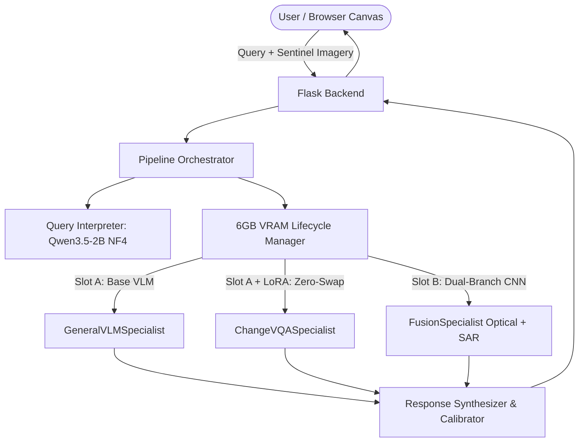

# SatQuery AI: Intelligent Multi-Specialist Satellite Intelligence System

**Smart India Hackathon (SIH 2026) Prototype & Research Preview**

SatQuery AI is an end-to-end multi-specialist satellite question-answering and geospatial intelligence platform engineered to execute complex Earth Observation (EO) queries under a strict **6GB VRAM budget** on consumer/laptop GPUs (such as the NVIDIA RTX 4050).

---

## 🛰️ System Architecture & Edge Optimization

---

## ⚡ Deployment Profile & Scientific Honesty

- **Edge Hardware Target:** 1× NVIDIA RTX 4050 (6GB VRAM / Laptop GPU)
- **VRAM Budget:** 5.07 GB Active $\le$ 5.64 GB Usable Ceiling
- **Zero-Swap Weight Sharing:** 0.0001s switching latency between General VLM and Change Detection LoRA.
- **Multi-Modal Optical-SAR Fusion:** Custom dual-branch ResNet CNN fusing Sentinel-2 Optical (RGB) and Sentinel-1 SAR (Radar backscatter) with Grad-CAM spatial heatmaps.

> **Notice regarding this Cloud Prototype:**  
> This public web prototype runs on a lightweight zero-GPU cloud evaluation node. Full real-time neural specialist execution under our 6GB VRAM budget on consumer edge hardware (NVIDIA RTX 4050) is demonstrated in our technical video demo.

---

## 📂 Repository Contents

- `checkpoints/fusion_model.pt` (1.6 MB): Trained PyTorch weights for Optical-SAR dual-branch CNN
- `checkpoints/qwen2.5-vl-cdvqa-lora/` (111 MB): Fine-tuned LoRA weights for bi-temporal change detection
- `scripts/`: Full multi-specialist neural federation pipeline and 6GB lifecycle manager
- `data/`: Real Indian satellite probe datasets (Cartosat/RISAT references for Assam, Chennai, Delhi, Munnar, Kochi) and BEN-GE-8K/SECOND benchmark samples
- `ui/`: Interactive 60fps canvas, HUD telemetry, and split-screen bitemporal slider
- `docs/`: Complete feasibility math and architectural context
